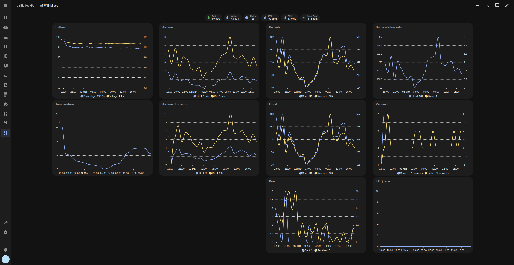

# Dashboards

Dashboards for the [MeshCore Home Assistant](https://meshcore-dev.github.io/meshcore-ha/) integration.

## Repeater

Requires: [ApexCharts Card](https://github.com/RomRider/apexcharts-card)

Replace placeholders:

* `<pubkey>` with repeater's public key prefix (e.g., `f439b9bab9`)
* `<repeater_name>` with repeater's name (e.g., `at_w_enkbase`)
* `<repeater_name_human_readable>` with the name you want to display

